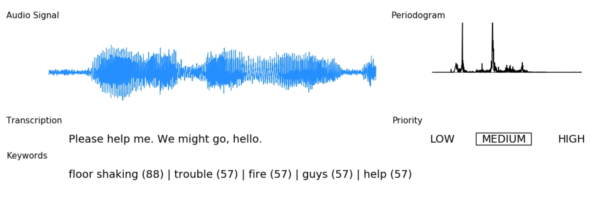
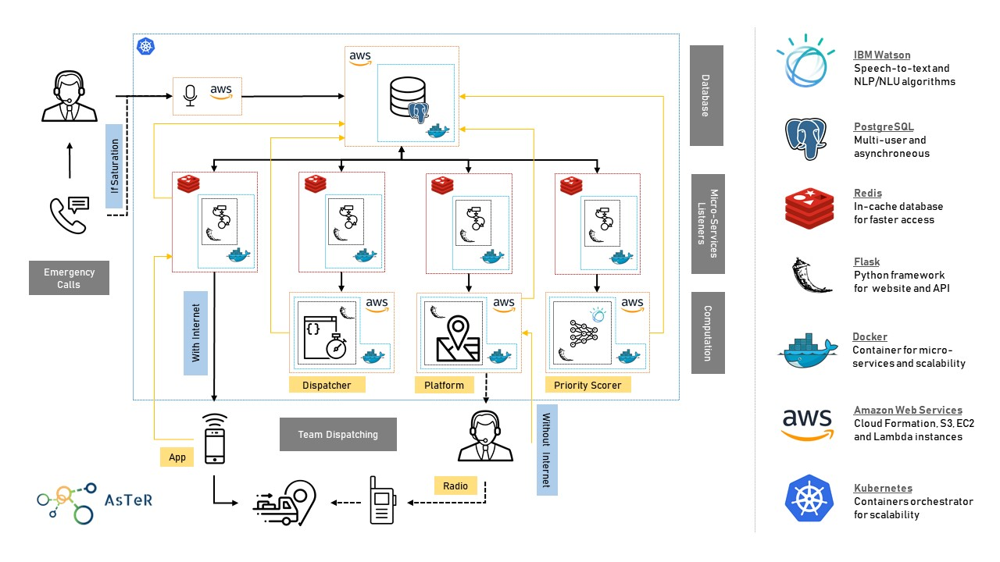

# (Dis)AsTeR

This open-source project started on April 27th. During the IBM Call for Code hackathon at UC Berkeley, we decided to build a disaster manager platform to dispatch the right resources at the right time given whatever inputs we may have. Some of those inputs include:

- Emergency calls to 911, which are analyzed in real-time. Through speech-to-text technology, we extract insights about the problem, we quantify the priority and detect the keywords related to the issue for further control.

- Pictures taken on the field by the rescue team, that are passing through image classification, to automatically detect the problem encountered. It allows us to update the map (graph) in real-time, which is exploited via a Dijkstra algorithm for optimal trajectories determination.

For our first example, we considered the city of San Francisco and simulated the dispatch of forces on the field. What would happen during the Big One? How would the city react? What are the resources available for us to mitigate the aftermath? ...

## General System Architecture

